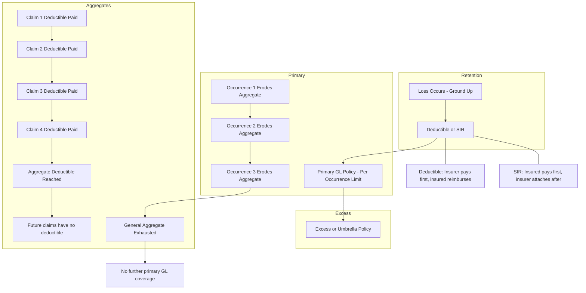

# policy-layers
Layering of different liability policy structures 

```mermaid
flowchart TD

    %% Ground-Up Loss Stack
    L[Loss Occurs - Ground Up] --> R[Deductible or SIR]
    R --> P[Primary GL Policy - Per Occurrence Limit]
    P --> E[Excess or Umbrella Policy]

    %% Deductible vs SIR Notes
    R --- D1[Deductible: Insurer pays first, insured reimburses]
    R --- D2[SIR: Insured pays first, insurer attaches after]

    %% Aggregate Deductible Accumulation
    AD1[Claim 1 Deductible Paid] --> AD2[Claim 2 Deductible Paid]
    AD2 --> AD3[Claim 3 Deductible Paid]
    AD3 --> AD4[Claim 4 Deductible Paid]
    AD4 --> ADCAP[Aggregate Deductible Reached]
    ADCAP --> ADSTOP[Future claims have no deductible]

    %% Aggregate Limit Erosion
    O1[Occurrence 1 Erodes Aggregate] --> O2[Occurrence 2 Erodes Aggregate]
    O2 --> O3[Occurrence 3 Erodes Aggregate]
    O3 --> AGGEX[General Aggregate Exhausted]
    AGGEX --> NOCOV[No further primary GL coverage]

    %% Grouping
    subgraph Retention
        L
        R
    end

    subgraph Primary
        P
        O1
        O2
        O3
    end

    subgraph Aggregates
        AD1
        AD2
        AD3
        AD4
        ADCAP
        ADSTOP
        AGGEX
    end

    subgraph Excess
        E
    end
```
